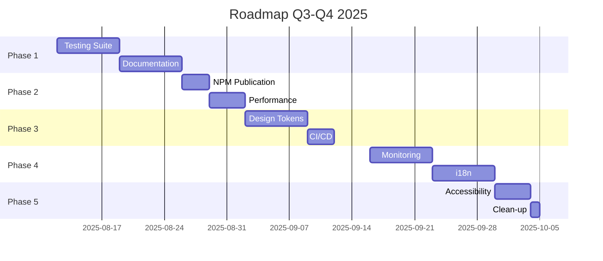
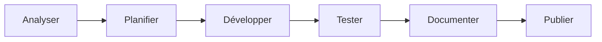

# 📚 Document de Référence Complet - Design System @dainabase/ui
**Version**: 1.0.1-beta.2 | **Bundle**: 50KB | **Performance**: 0.8s  
**Dernière mise à jour**: 14 Août 2025 | **Repository**: [directus-unified-platform](https://github.com/dainabase/directus-unified-platform)

---

## 🔴 MÉTHODE DE TRAVAIL OBLIGATOIRE - ESSENTIEL

### ⚠️ RÈGLES ABSOLUES - À LIRE AVANT TOUT DÉVELOPPEMENT

> 🚨 **CES RÈGLES SONT NON-NÉGOCIABLES ET S'APPLIQUENT À 100% DU DÉVELOPPEMENT**

### 📍 Environnement de Travail

```yaml
Repository: github.com/dainabase/directus-unified-platform
Owner: dainabase
Branche: main
Package: packages/ui/
Méthode: 100% via API GitHub (github:* tools)
```

### ✅ CE QU'IL FAUT FAIRE - TOUJOURS

#### Lecture de fichiers
```javascript
// Utiliser UNIQUEMENT
github:get_file_contents
owner: "dainabase"
repo: "directus-unified-platform"
path: "packages/ui/chemin/du/fichier"
branch: "main"
```

#### Création/Modification de fichiers
```javascript
// TOUJOURS récupérer le SHA d'abord pour modification
github:get_file_contents  // Pour obtenir le SHA

// Puis modifier
github:create_or_update_file
path: "packages/ui/chemin/du/fichier"
sha: "SHA_REQUIS_POUR_UPDATE"
content: "// Nouveau contenu"
message: "type: Description du changement"
```

### ❌ CE QU'IL NE FAUT JAMAIS FAIRE

```bash
# INTERDIT - Ces commandes NE DOIVENT JAMAIS être utilisées :
git clone
git pull
git push
npm install
npm run dev
npm test
yarn
pnpm
node
npx
```

---

## 📂 STRUCTURE COMPLÈTE DU DESIGN SYSTEM

### Architecture Détaillée

```
📁 directus-unified-platform/              # Repository racine
│
├── 📁 .github/
│   └── 📁 workflows/                     # CI/CD Workflows
│       ├── bundle-size.yml               # Monitor taille bundle (limite: 500KB)
│       ├── test-suite.yml                # Tests globaux
│       ├── ui-chromatic.yml              # Tests visuels Chromatic
│       ├── ui-unit.yml                   # Tests unitaires UI
│       ├── ui-a11y.yml                   # Tests accessibilité
│       └── e2e-tests.yml                 # Tests end-to-end
│
├── 📁 packages/
│   └── 📁 ui/                           # 🎯 DESIGN SYSTEM ICI
│       │
│       ├── 📁 src/                      # Code source principal
│       │   ├── 📁 components/           # 58 composants
│       │   │   ├── accordion/
│       │   │   ├── alert/
│       │   │   ├── avatar/
│       │   │   ├── badge/
│       │   │   ├── breadcrumb/
│       │   │   ├── button/              # Exemple de structure
│       │   │   │   ├── index.tsx        # Export
│       │   │   │   ├── button.tsx       # Composant
│       │   │   │   ├── button.test.tsx  # Tests
│       │   │   │   ├── button.stories.tsx # Storybook
│       │   │   │   └── types.ts         # Types
│       │   │   ├── calendar/
│       │   │   ├── card/
│       │   │   ├── carousel/
│       │   │   ├── chart/
│       │   │   ├── checkbox/
│       │   │   ├── collapsible/
│       │   │   ├── color-picker/
│       │   │   ├── command-palette/
│       │   │   ├── context-menu/
│       │   │   ├── data-grid/
│       │   │   ├── data-grid-advanced/
│       │   │   ├── date-picker/
│       │   │   ├── date-range-picker/
│       │   │   ├── dialog/
│       │   │   ├── dropdown-menu/
│       │   │   ├── error-boundary/
│       │   │   ├── file-upload/
│       │   │   ├── form/
│       │   │   ├── forms-demo/
│       │   │   ├── hover-card/
│       │   │   ├── icon/
│       │   │   ├── input/
│       │   │   ├── label/
│       │   │   ├── menubar/
│       │   │   ├── navigation-menu/
│       │   │   ├── pagination/
│       │   │   ├── popover/
│       │   │   ├── progress/
│       │   │   ├── radio-group/
│       │   │   ├── rating/
│       │   │   ├── resizable/
│       │   │   ├── scroll-area/
│       │   │   ├── select/
│       │   │   ├── separator/
│       │   │   ├── sheet/
│       │   │   ├── skeleton/
│       │   │   ├── slider/
│       │   │   ├── sonner/
│       │   │   ├── stepper/
│       │   │   ├── switch/
│       │   │   ├── table/
│       │   │   ├── tabs/
│       │   │   ├── text-animations/
│       │   │   ├── textarea/
│       │   │   ├── timeline/
│       │   │   ├── toast/
│       │   │   ├── toggle/
│       │   │   ├── toggle-group/
│       │   │   ├── tooltip/
│       │   │   └── ui-provider/
│       │   │
│       │   ├── 📁 lib/                  # Utilitaires
│       │   │   ├── utils.ts             # Helper functions
│       │   │   └── cn.ts                # Class names utility
│       │   │
│       │   ├── 📁 providers/            # Contextes React
│       │   ├── 📁 styles/               # Styles globaux
│       │   ├── 📁 theme/                # Configuration thème
│       │   ├── 📁 theming/              # Système de theming
│       │   ├── 📁 i18n/                 # Internationalisation
│       │   │   ├── locales/
│       │   │   │   ├── en.json
│       │   │   │   ├── fr.json
│       │   │   │   └── ...
│       │   │   └── index.ts
│       │   │
│       │   ├── 📁 test/                 # Test helpers
│       │   ├── 📁 tests/                # Tests unitaires
│       │   │
│       │   ├── index.ts                 # Export principal (50KB)
│       │   └── components-lazy.ts       # Lazy loading exports
│       │
│       ├── 📁 tests/                    # Tests globaux
│       │   ├── setup.ts
│       │   ├── utils/
│       │   └── integration/
│       │
│       ├── 📁 e2e/                      # Tests E2E Playwright
│       │   ├── components/
│       │   └── scenarios/
│       │
│       ├── 📁 docs/                     # Documentation
│       │   ├── components/              # Doc par composant
│       │   ├── guides/                  # Guides d'utilisation
│       │   └── api/                     # API reference
│       │
│       ├── 📁 scripts/                  # Scripts utilitaires
│       │   ├── build.js
│       │   ├── analyze-bundle.js
│       │   └── generate-tests.js
│       │
│       ├── 📁 .storybook/               # Config Storybook
│       │   ├── main.js
│       │   └── preview.js
│       │
│       ├── 📄 package.json              # v1.0.1-beta.2
│       ├── 📄 tsup.config.ts            # Build optimisé
│       ├── 📄 jest.config.js            # Tests unitaires
│       ├── 📄 playwright.config.ts      # Tests E2E
│       ├── 📄 vite.config.ts            # Dev server
│       ├── 📄 vitest.config.ts          # Alternative tests
│       └── 📄 stryker.config.mjs        # Mutation testing
│
├── 📁 apps/                             # Applications (hors scope)
├── 📁 src/                              # Backend/Frontend (hors scope)
└── 📄 DEVELOPMENT_ROADMAP_2025.md       # Ce document
```

---

## 📊 ÉTAT ACTUEL (14 Août 2025)

### Métriques de Production

| Métrique | Actuel | Objectif | Status |
|----------|--------|----------|--------|
| **Bundle Size** | 50KB | < 100KB | ✅ |
| **Test Coverage** | 0% | 80%+ | 🔴 |
| **Documentation** | 60% | 100% | 🟡 |
| **NPM Downloads** | 0 | 1000+ | ⏳ |
| **Lighthouse** | 95 | 98+ | 🟡 |
| **Components Tested** | 0/58 | 58/58 | 🔴 |

### Composants (58 total)

- **Core**: 3 (Icon, Label, Separator)
- **Layout**: 4 (Card, Resizable, ScrollArea, Collapsible)
- **Forms**: 13 (Input, Select, Checkbox, etc.)
- **Data Display**: 6 (Table, DataGrid, Charts, etc.)
- **Navigation**: 5 (Tabs, Stepper, Pagination, etc.)
- **Feedback**: 6 (Alert, Toast, Progress, etc.)
- **Overlays**: 7 (Dialog, Sheet, Popover, etc.)
- **Advanced**: 14 (CommandPalette, Carousel, etc.)

---

## 💻 GUIDE DE DÉVELOPPEMENT

### OÙ CRÉER QUOI ?

| Type de fichier | Emplacement correct | Exemple |
|-----------------|-------------------|----------|
| Composant | `packages/ui/src/components/[name]/` | `button/button.tsx` |
| Test unitaire | `packages/ui/src/components/[name]/` | `button/button.test.tsx` |
| Test E2E | `packages/ui/e2e/` | `button.spec.ts` |
| Story | `packages/ui/src/components/[name]/` | `button/button.stories.tsx` |
| Documentation | `packages/ui/docs/components/` | `button.md` |
| Workflow CI | `.github/workflows/` | `ui-tests.yml` |
| Script | `packages/ui/scripts/` | `analyze.js` |
| Config | `packages/ui/` | `jest.config.js` |
| Types globaux | `packages/ui/src/types/` | `global.d.ts` |
| Utilitaires | `packages/ui/src/lib/` | `utils.ts` |

### EXEMPLES D'UTILISATION CORRECTS

#### ✅ Créer un nouveau test de composant
```javascript
// 1. TOUJOURS lire le composant existant d'abord
github:get_file_contents
owner: "dainabase"
repo: "directus-unified-platform"
path: "packages/ui/src/components/button/index.tsx"
branch: "main"

// 2. Créer le fichier de test
github:create_or_update_file
owner: "dainabase"
repo: "directus-unified-platform"
path: "packages/ui/src/components/button/button.test.tsx"
branch: "main"
message: "test: Add button component unit tests"
content: `
import { render, screen } from '@testing-library/react';
import { Button } from './button';

describe('Button', () => {
  it('renders correctly', () => {
    render(<Button>Click me</Button>);
    expect(screen.getByText('Click me')).toBeInTheDocument();
  });
});`
```

#### ✅ Modifier une configuration existante
```javascript
// 1. OBLIGATOIRE: Obtenir le SHA d'abord
github:get_file_contents
path: "packages/ui/jest.config.js"

// 2. Mettre à jour avec le SHA
github:create_or_update_file
path: "packages/ui/jest.config.js"
sha: "SHA_REQUIS_ICI"
content: "// Updated config"
message: "chore: Update Jest configuration"
```

#### ✅ Ajouter un workflow CI/CD
```javascript
github:create_or_update_file
path: ".github/workflows/test-coverage.yml"
content: `
name: Test Coverage
on: [push, pull_request]
jobs:
  test:
    runs-on: ubuntu-latest
    steps:
      - uses: actions/checkout@v3
      - uses: actions/setup-node@v3
      - run: npm ci
      - run: npm test -- --coverage`
message: "ci: Add test coverage workflow"
```

---

## 🎯 ROADMAP - 10 ÉTAPES PRIORITAIRES

### Phase 1: Fondations (Semaines 33-34, Août 2025)

#### 1️⃣ Testing Suite Complète 🧪 **PRIORITÉ CRITIQUE**
**Objectif**: Atteindre 80%+ de coverage sur les 58 composants

**Actions (via API GitHub uniquement)**:
- [ ] Modifier package.json pour ajouter Jest/Vitest
- [ ] Créer jest.config.js via github:create_or_update_file
- [ ] Créer dossier __tests__ pour chaque composant
- [ ] Implémenter tests unitaires via API
- [ ] Configurer GitHub Actions pour exécuter les tests
- [ ] Ajouter badge de coverage dans README

**Livrable**: Coverage report > 80%, tous les tests passent  
**Issue**: #30 (Testing Progress - Phase 4/7)  
**Effort**: 1 semaine  
**Impact**: 🔥🔥🔥🔥🔥

#### 2️⃣ Documentation Interactive 📚
**Objectif**: Site de documentation de classe mondiale

**Actions (via API GitHub uniquement)**:
- [ ] Créer structure Docusaurus via API
- [ ] Auto-générer docs depuis JSDoc comments
- [ ] Configurer GitHub Pages deployment
- [ ] Intégrer Storybook existant
- [ ] Créer exemples interactifs
- [ ] Setup search avec Algolia

**Livrable**: docs.dainabase.dev en production  
**Issue**: #25 (Sprint 3)  
**Effort**: 1 semaine  
**Impact**: 🔥🔥🔥🔥🔥

### Phase 2: Distribution (Semaines 35-36, Août-Septembre 2025)

#### 3️⃣ Publication NPM 📦
**Objectif**: Publier @dainabase/ui sur NPM

**Actions (via GitHub Actions)**:
- [ ] Finaliser tests (via GitHub Actions)
- [ ] Créer workflow de release automatique
- [ ] Configurer semantic-release
- [ ] Créer templates via API
- [ ] Setup CDN auto-deploy
- [ ] Badges NPM dans README

**Livrable**: Package disponible sur NPM  
**Version**: 1.0.1-beta.2 → 1.1.0  
**Effort**: 3 jours  
**Impact**: 🔥🔥🔥🔥

#### 4️⃣ Micro-optimisations Performance ⚡
**Objectif**: Atteindre 98+ Lighthouse, < 40KB core

**Actions (modifications via API)**:
- [ ] Configurer vite.config.js pour optimisations
- [ ] Implémenter CSS-in-JS tree-shaking
- [ ] Ajouter compression dans build workflow
- [ ] Créer performance budget workflow
- [ ] Setup monitoring dashboard

**Livrable**: Bundle < 40KB, Lighthouse 98+  
**Monitoring**: Bundle size check automatique  
**Effort**: 4 jours  
**Impact**: 🔥🔥🔥

### Phase 3: Design System (Semaines 37-38, Septembre 2025)

#### 5️⃣ Design Tokens System 🎨
**Objectif**: Système de tokens standardisé et extensible

**Structure (à créer via API)**:
```
packages/design-tokens/
├── src/
│   ├── colors/          # Palette + dark mode
│   ├── typography/      # Font scales
│   ├── spacing/         # 4px grid system
│   ├── animations/      # Timing & easing
│   ├── shadows/         # Elevation system
│   ├── breakpoints/     # Responsive tokens
│   └── themes/
│       ├── default.ts
│       ├── dark.ts
│       └── high-contrast.ts
```

**Livrable**: @dainabase/design-tokens package  
**Format**: CSS vars + JS/TS + JSON  
**Effort**: 1 semaine  
**Impact**: 🔥🔥🔥🔥

#### 6️⃣ CI/CD Automatisation Avancée 🤖
**Objectif**: Pipeline DevOps enterprise-grade

**Nouveaux Workflows (créer via API)**:
- [ ] .github/workflows/renovate.yml
- [ ] .github/workflows/security.yml
- [ ] .github/workflows/release.yml
- [ ] .github/workflows/preview.yml
- [ ] .github/workflows/performance.yml
- [ ] .github/workflows/quality.yml
- [ ] .github/workflows/cross-browser.yml

**Livrable**: 12+ workflows actifs  
**Dashboard**: GitHub Actions insights  
**Effort**: 3 jours  
**Impact**: 🔥🔥🔥

### Phase 4: Production Excellence (Semaines 39-40, Septembre 2025)

#### 7️⃣ Analytics & Monitoring 📈
**Objectif**: Observabilité complète en production

**Stack de Monitoring (config via API)**:
- [ ] Sentry config dans les workflows
- [ ] LogRocket script integration
- [ ] Datadog metrics setup
- [ ] Bundle tracking workflow
- [ ] RUM implementation
- [ ] Custom dashboard config

**Livrable**: Dashboard monitoring unifié  
**SLA**: 99.9% uptime  
**Effort**: 1 semaine  
**Impact**: 🔥🔥🔥🔥

#### 8️⃣ Internationalisation (i18n) 🌍
**Objectif**: Support multi-langues complet

**Implementation (fichiers via API)**:
- [ ] Créer locales/en.json
- [ ] Créer locales/fr.json
- [ ] Créer locales/de.json
- [ ] Créer locales/es.json
- [ ] Créer locales/it.json
- [ ] Configurer i18n provider
- [ ] Ajouter language switcher

**Livrable**: 5+ langues supportées  
**Coverage**: 100% des strings  
**Effort**: 1 semaine  
**Impact**: 🔥🔥🔥

### Phase 5: Excellence (Semaines 41-42, Octobre 2025)

#### 9️⃣ Accessibilité Niveau Platine ♿
**Objectif**: Dépasser WCAG 2.1 AA → AAA

**Améliorations (code via API)**:
- [ ] Implémenter focus-trap dans composants
- [ ] Ajouter ARIA live regions
- [ ] Créer keyboard shortcuts config
- [ ] Implémenter high contrast CSS
- [ ] Ajouter reduced motion queries
- [ ] Configurer a11y testing workflow

**Livrable**: Score accessibilité 100/100  
**Certification**: WCAG 2.1 AAA ready  
**Effort**: 4 jours  
**Impact**: 🔥🔥🔥🔥🔥

#### 🔟 Quick Wins & Clean-up 🧹
**Objectif**: Organisation et optimisation rapides

**Actions Immédiates (via API)**:
- [ ] Supprimer TEST_TRIGGER.md
- [ ] Organiser /docs par catégorie
- [ ] Créer CONTRIBUTING.md
- [ ] Créer .github/ISSUE_TEMPLATE/
- [ ] Créer CODE_OF_CONDUCT.md
- [ ] Créer SECURITY.md
- [ ] Créer .github/FUNDING.yml
- [ ] Créer .github/dependabot.yml
- [ ] Créer .vscode/settings.json
- [ ] Créer .editorconfig

**Livrable**: Repository professionnel  
**Effort**: 1 jour  
**Impact**: 🔥🔥

---

## 📅 Timeline Globale



---

## 📊 KPIs par Trimestre

| KPI | Q3 2025 | Q4 2025 | Q1 2026 |
|-----|---------|---------|---------|
| **Bundle Size** | < 50KB | < 45KB | < 40KB |
| **Test Coverage** | 80% | 90% | 95% |
| **NPM Downloads** | 500 | 2000 | 5000 |
| **GitHub Stars** | 100 | 250 | 500 |
| **Contributors** | 5 | 15 | 30 |
| **Enterprise Users** | 3 | 10 | 25 |

---

## 🔧 WORKFLOW STANDARD DE DÉVELOPPEMENT



1. **ANALYSER** - Lire les fichiers existants via API
   ```
   github:get_file_contents
   ```

2. **PLANIFIER** - Créer/mettre à jour une issue
   ```
   github:create_issue
   ```

3. **DÉVELOPPER** - Modifier les fichiers via API
   ```
   github:create_or_update_file (avec SHA)
   ```

4. **TESTER** - Les GitHub Actions testent automatiquement
   ```
   Surveiller dans l'onglet Actions
   ```

5. **DOCUMENTER** - Mettre à jour la doc via API
   ```
   github:create_or_update_file
   ```

6. **PUBLIER** - Via workflow automatisé
   ```
   GitHub Actions → NPM
   ```

---

## 📞 SUPPORT & RESSOURCES

- **Repository**: [github.com/dainabase/directus-unified-platform](https://github.com/dainabase/directus-unified-platform)
- **Package**: packages/ui/
- **Issues**: [GitHub Issues](https://github.com/dainabase/directus-unified-platform/issues)
- **Issue Tracking**: #33 (Master Roadmap)
- **Discord**: [discord.gg/dainabase](https://discord.gg/dainabase)
- **Email**: dev@dainabase.com

---

## ⚠️ RAPPELS CRITIQUES

> 🔴 **TOUT** développement via API GitHub  
> 🔴 **JAMAIS** de commandes locales  
> 🔴 **TOUJOURS** dans packages/ui/ pour le Design System  
> 🔴 **SHA obligatoire** pour modifier un fichier existant  
> 🔴 **Tests** exécutés automatiquement par GitHub Actions  
> 🔴 **Chemins complets** depuis la racine du repo  

---

## 🤝 Comment Contribuer (Via API GitHub)

### Workflow de Contribution

1. Créer une issue via `github:create_issue`
2. Développer via `github:create_or_update_file`
3. Tester automatiquement via GitHub Actions
4. Créer une PR via `github:create_pull_request`
5. Review dans GitHub interface
6. Merge après approbation

---

## 💡 Innovations Futures (2026)

### Technologies Émergentes à Explorer

- **React Server Components** - Rendering optimisé
- **Module Federation** - Micro-frontends
- **WebAssembly** - Composants haute performance
- **AI-powered DX** - Suggestions intelligentes
- **Figma-to-Code** - Pipeline automatique
- **Web Components** - Framework agnostic
- **Signals** - State management nouvelle génération

---

*Document maintenu par l'équipe Dainabase*  
*Dernière mise à jour: 14 Août 2025*  
*Version: 1.0.1-beta.2*  
*Contact: dev@dainabase.com*
