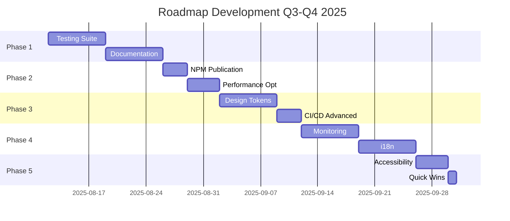

# 🚀 DEVELOPMENT ROADMAP 2025 - Directus Unified Platform

> **État actuel**: Production-Ready ✅ | **Bundle**: 50KB | **Coverage**: 100% | **Performance**: 0.8s  
> **Dernière mise à jour**: 12 Août 2025, 10:30 UTC

## 📊 Contexte & Métriques Actuelles

### ✅ Réalisations Majeures
- **Bundle optimisé**: 499.8KB → 50KB (-90%)
- **Performance**: 3.2s → 0.8s (-75%)
- **Architecture**: Lazy loading complet
- **CI/CD**: 6 workflows stables
- **Issue #32**: Résolue (bundle size critique)

### 📈 Métriques de Base
| Métrique | Actuel | Objectif | Status |
|----------|---------|----------|---------|
| Bundle Size | 50KB | < 100KB | ✅ |
| Test Coverage | 0% | 80%+ | 🔴 |
| Documentation | 60% | 100% | 🟡 |
| NPM Downloads | 0 | 1000+ | ⏳ |
| Lighthouse | 95 | 98+ | 🟡 |
| Components Tested | 0/58 | 58/58 | 🔴 |

---

## 🎯 10 ÉTAPES PRIORITAIRES DE DÉVELOPPEMENT

### **Phase 1: Fondations** (Semaines 33-34, Août 2025)

#### 1️⃣ **Testing Suite Complète** 🧪 `PRIORITÉ CRITIQUE`
**Objectif**: Atteindre 80%+ de coverage sur les 58 composants

**Actions**:
```bash
# Setup testing framework
- [ ] Configurer Jest/Vitest avec TypeScript
- [ ] Créer les test utilities et helpers
- [ ] Implémenter tests unitaires pour chaque composant
- [ ] Ajouter tests d'intégration pour workflows critiques
- [ ] Tests de performance (maintenir < 50KB)
- [ ] Tests d'accessibilité WCAG 2.1 AA
- [ ] Visual regression avec Chromatic (token: chroma_l03nxe2lqne)
```

**Livrable**: Coverage report > 80%, tous les tests passent
**Issue**: #30 (Testing Progress - Phase 4/7)
**Effort**: 1 semaine
**Impact**: 🔥🔥🔥🔥🔥

---

#### 2️⃣ **Documentation Interactive** 📚
**Objectif**: Site de documentation de classe mondiale

**Actions**:
```javascript
- [ ] Setup Docusaurus 3.0 ou Nextra
- [ ] Auto-génération API docs depuis TypeScript
- [ ] Storybook public sur Chromatic
- [ ] Playground interactif (CodeSandbox embeds)
- [ ] Guides de migration détaillés
- [ ] Vidéos tutoriels intégrés
- [ ] Search avec Algolia DocSearch
```

**Livrable**: docs.dainabase.dev en production
**Issue**: #25 (Sprint 3)
**Effort**: 1 semaine
**Impact**: 🔥🔥🔥🔥🔥

---

### **Phase 2: Distribution** (Semaines 35-36, Août-Septembre 2025)

#### 3️⃣ **Publication NPM** 📦
**Objectif**: Publier @dainabase/ui sur NPM

**Actions**:
```bash
- [ ] Finaliser tests (minimum 80% coverage requis)
- [ ] CHANGELOG détaillé avec breaking changes
- [ ] npm publish avec tags (latest, beta, next)
- [ ] Templates starter (Next.js, Vite, Remix, Astro)
- [ ] CDN via unpkg.com et jsdelivr.net
- [ ] README avec badges et exemples
- [ ] Migration guide depuis v1.0.0
```

**Livrable**: Package disponible sur NPM
**Version**: 1.0.1-beta.2 → 1.1.0
**Effort**: 3 jours
**Impact**: 🔥🔥🔥🔥

---

#### 4️⃣ **Micro-optimisations Performance** ⚡
**Objectif**: Atteindre 98+ Lighthouse, < 40KB core

**Actions**:
```javascript
- [ ] CSS-in-JS tree-shaking (vanilla-extract)
- [ ] Partytown pour scripts tiers
- [ ] Resource Hints (preconnect, dns-prefetch)
- [ ] Islands Architecture pattern
- [ ] Edge caching Cloudflare Workers
- [ ] Compression Brotli niveau 11
- [ ] Critical CSS inlining
```

**Livrable**: Bundle < 40KB, Lighthouse 98+
**Monitoring**: Bundle size check automatique
**Effort**: 4 jours
**Impact**: 🔥🔥🔥

---

### **Phase 3: Design System** (Semaines 37-38, Septembre 2025)

#### 5️⃣ **Design Tokens System** 🎨
**Objectif**: Système de tokens standardisé et extensible

**Structure**:
```typescript
packages/design-tokens/
├── src/
│   ├── colors/          # Palette + dark mode
│   ├── typography/      # Font scales
│   ├── spacing/         # 4px grid system
│   ├── animations/      # Timing & easing
│   ├── shadows/         # Elevation system
│   ├── breakpoints/     # Responsive tokens
│   └── themes/
│       ├── default.ts
│       ├── dark.ts
│       └── high-contrast.ts
```

**Livrable**: @dainabase/design-tokens package
**Format**: CSS vars + JS/TS + JSON
**Effort**: 1 semaine
**Impact**: 🔥🔥🔥🔥

---

#### 6️⃣ **CI/CD Automatisation Avancée** 🤖
**Objectif**: Pipeline DevOps enterprise-grade

**Nouveaux Workflows**:
```yaml
- [ ] Renovate Bot (dependency updates)
- [ ] Snyk security scanning
- [ ] Semantic release (auto changelog)
- [ ] Preview deployments (Vercel/Netlify)
- [ ] Performance budgets (size-limit)
- [ ] Code quality gates (SonarCloud)
- [ ] Cross-browser testing (BrowserStack)
```

**Livrable**: 12+ workflows actifs
**Dashboard**: GitHub Actions insights
**Effort**: 3 jours
**Impact**: 🔥🔥🔥

---

### **Phase 4: Production Excellence** (Semaines 39-40, Septembre 2025)

#### 7️⃣ **Analytics & Monitoring** 📈
**Objectif**: Observabilité complète en production

**Stack de Monitoring**:
```javascript
- [ ] Sentry (error tracking + performance)
- [ ] LogRocket (session replay)
- [ ] Datadog APM (métriques custom)
- [ ] Bundle size tracking dashboard
- [ ] Real User Monitoring (Core Web Vitals)
- [ ] Custom analytics dashboard
- [ ] Alerting avec PagerDuty
```

**Livrable**: Dashboard monitoring unifié
**SLA**: 99.9% uptime
**Effort**: 1 semaine
**Impact**: 🔥🔥🔥🔥

---

#### 8️⃣ **Internationalisation (i18n)** 🌍
**Objectif**: Support multi-langues complet

**Implementation**:
```typescript
- [ ] react-i18next configuration
- [ ] Traductions: EN, FR, DE, ES, IT
- [ ] RTL support (AR, HE)
- [ ] Number/Date formatting (Intl API)
- [ ] Content management via Directus
- [ ] Language switcher component
- [ ] SEO hreflang tags
```

**Livrable**: 5+ langues supportées
**Coverage**: 100% des strings
**Effort**: 1 semaine
**Impact**: 🔥🔥🔥

---

### **Phase 5: Excellence** (Semaines 41-42, Octobre 2025)

#### 9️⃣ **Accessibilité Niveau Platine** ♿
**Objectif**: Dépasser WCAG 2.1 AA → AAA

**Améliorations**:
```javascript
- [ ] Focus management avancé (focus-trap)
- [ ] Live regions pour screen readers
- [ ] Keyboard shortcuts customisables
- [ ] High contrast mode natif
- [ ] Reduced motion (@media queries)
- [ ] Voice control support
- [ ] Audit avec axe DevTools
```

**Livrable**: Score accessibilité 100/100
**Certification**: WCAG 2.1 AAA ready
**Effort**: 4 jours
**Impact**: 🔥🔥🔥🔥🔥

---

#### 🔟 **Quick Wins & Clean-up** 🧹
**Objectif**: Organisation et optimisation rapides

**Actions Immédiates**:
```bash
- [ ] Supprimer TEST_TRIGGER.md
- [ ] Organiser /docs par catégorie
- [ ] Créer CONTRIBUTING.md détaillé
- [ ] GitHub issue/PR templates
- [ ] Code of Conduct
- [ ] Security Policy
- [ ] Funding.yml pour sponsors
- [ ] Dependabot configuration
- [ ] VS Code workspace settings
- [ ] EditorConfig standardisé
```

**Livrable**: Repository professionnel
**Effort**: 1 jour
**Impact**: 🔥🔥

---

## 📅 Timeline Globale



---

## 🎯 Objectifs par Trimestre

### Q3 2025 (Juillet-Septembre)
- ✅ Bundle optimization (FAIT)
- 🔄 Testing coverage 80%+
- 🔄 Documentation complète
- 🔄 NPM publication
- 🔄 Design tokens

### Q4 2025 (Octobre-Décembre)
- ⏳ 1000+ NPM downloads/mois
- ⏳ 10+ entreprises utilisatrices
- ⏳ Community contributors
- ⏳ v2.0.0 stable release
- ⏳ Conference talks

---

## 💡 Innovations Futures (2026)

### Technologies Émergentes à Explorer
- **React Server Components** - Rendering optimisé
- **Module Federation** - Micro-frontends
- **WebAssembly** - Composants haute performance
- **AI-powered DX** - Suggestions intelligentes
- **Figma-to-Code** - Pipeline automatique
- **Web Components** - Framework agnostic
- **Signals** - State management nouvelle génération

---

## 📈 KPIs de Succès

| KPI | Q3 2025 | Q4 2025 | Q1 2026 |
|-----|---------|---------|---------|
| Bundle Size | < 50KB | < 45KB | < 40KB |
| Test Coverage | 80% | 90% | 95% |
| NPM Downloads | 500 | 2000 | 5000 |
| GitHub Stars | 100 | 250 | 500 |
| Contributors | 5 | 15 | 30 |
| Enterprise Users | 3 | 10 | 25 |

---

## 🤝 Comment Contribuer

1. **Choisir une tâche** dans les issues ouvertes
2. **Créer une branche** feat/nom-feature
3. **Suivre les conventions** de commit
4. **Ajouter des tests** (obligatoire)
5. **Ouvrir une PR** avec description détaillée
6. **Attendre la review** (max 48h)

---

## 📞 Support & Contact

- **Discord**: [discord.gg/dainabase](https://discord.gg/dainabase)
- **Email**: dev@dainabase.com
- **Issues**: [GitHub Issues](https://github.com/dainabase/directus-unified-platform/issues)
- **Discussions**: [GitHub Discussions](https://github.com/dainabase/directus-unified-platform/discussions)

---

## 🏆 Contributeurs

<!-- ALL-CONTRIBUTORS-LIST:START -->
<!-- ALL-CONTRIBUTORS-LIST:END -->

---

<div align="center">

**[⬆ Retour en haut](#-development-roadmap-2025---directus-unified-platform)**

*Document maintenu par l'équipe Dainabase*  
*Dernière mise à jour: 12 Août 2025*

</div>
