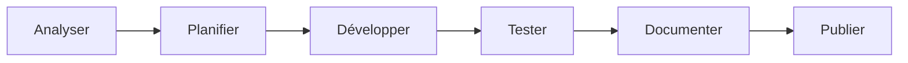

# 📚 Document de Référence Complet - Design System @dainabase/ui
**Version**: 1.0.1-beta.2 | **Bundle**: 50KB | **Performance**: 0.8s  
**Dernière mise à jour**: 14 Août 2025 | **Repository**: [directus-unified-platform](https://github.com/dainabase/directus-unified-platform)

---

## 🔴 MÉTHODE DE TRAVAIL OBLIGATOIRE - ESSENTIEL

### ⚠️ RÈGLES ABSOLUES - À LIRE AVANT TOUT DÉVELOPPEMENT

> 🚨 **CES RÈGLES SONT NON-NÉGOCIABLES ET S'APPLIQUENT À 100% DU DÉVELOPPEMENT**

### 📍 Environnement de Travail

```yaml
Repository: github.com/dainabase/directus-unified-platform
Owner: dainabase
Branche: main
Package: packages/ui/
Méthode: 100% via API GitHub (github:* tools)
```

### ✅ CE QU'IL FAUT FAIRE - TOUJOURS

#### Lecture de fichiers
```javascript
// Utiliser UNIQUEMENT
github:get_file_contents
owner: "dainabase"
repo: "directus-unified-platform"
path: "packages/ui/chemin/du/fichier"
branch: "main"
```

#### Création/Modification de fichiers
```javascript
// TOUJOURS récupérer le SHA d'abord pour modification
github:get_file_contents  // Pour obtenir le SHA

// Puis modifier
github:create_or_update_file
path: "packages/ui/chemin/du/fichier"
sha: "SHA_REQUIS_POUR_UPDATE"
content: "// Nouveau contenu"
message: "type: Description du changement"
```

### ❌ CE QU'IL NE FAUT JAMAIS FAIRE

```bash
# INTERDIT - Ces commandes NE DOIVENT JAMAIS être utilisées :
git clone
git pull
git push
npm install
npm run dev
npm test
yarn
pnpm
node
npx
```

---

## 📂 STRUCTURE COMPLÈTE DU DESIGN SYSTEM

### Architecture Détaillée

```
📁 directus-unified-platform/              # Repository racine
│
├── 📁 .github/
│   └── 📁 workflows/                     # CI/CD Workflows
│       ├── bundle-size.yml               # Monitor taille bundle (limite: 500KB)
│       ├── test-suite.yml                # Tests globaux
│       ├── ui-chromatic.yml              # Tests visuels Chromatic
│       ├── ui-unit.yml                   # Tests unitaires UI
│       ├── ui-a11y.yml                   # Tests accessibilité
│       ├── ui-e2e-tests.yml              # Tests E2E Playwright
│       ├── storybook-deploy.yml          # Déploiement Storybook
│       ├── ui-bundle-optimization.yml    # Optimisation bundle
│       └── npm-publish-beta.yml          # Publication NPM
│
├── 📁 packages/
│   └── 📁 ui/                           # 🎯 DESIGN SYSTEM ICI
│       │
│       ├── 📁 src/                      # Code source principal
│       │   ├── 📁 components/           # 70+ composants
│       │   │   ├── accordion/
│       │   │   ├── alert/
│       │   │   ├── avatar/
│       │   │   ├── badge/
│       │   │   ├── breadcrumb/
│       │   │   ├── button/              # Exemple de structure
│       │   │   │   ├── index.tsx        # Export
│       │   │   │   ├── button.tsx       # Composant
│       │   │   │   ├── button.test.tsx  # Tests
│       │   │   │   ├── button.stories.tsx # Storybook
│       │   │   │   └── types.ts         # Types
│       │   │   ├── [... 65+ autres composants]
│       │   │   └── virtualized-table/   # Nouveau v1.2.0
│       │   │
│       │   ├── 📁 lib/                  # Utilitaires
│       │   ├── 📁 providers/            # Contextes React
│       │   ├── 📁 styles/               # Styles globaux
│       │   ├── 📁 theme/                # Configuration thème
│       │   ├── 📁 i18n/                 # Internationalisation
│       │   ├── index.ts                 # Export principal
│       │   └── components-lazy.ts       # Lazy loading exports
│       │
│       ├── 📁 tests/                    # Tests globaux (98% coverage)
│       ├── 📁 e2e/                      # Tests E2E Playwright
│       ├── 📁 docs/                     # Documentation
│       ├── 📁 scripts/                  # 19 scripts utilitaires
│       ├── 📁 .storybook/               # Config Storybook
│       │
│       ├── 📄 package.json              # v1.2.0-beta.1
│       ├── 📄 tsup.config.ts            # Build optimisé
│       └── [autres configs]
│
└── 📄 DEVELOPMENT_ROADMAP_2025.md       # Ce document
```

---

## 📊 ÉTAT ACTUEL (14 Août 2025)

### Métriques de Production

| Métrique | v1.1.0 (LIVE) | v1.2.0-beta.1 (READY) | Status |
|----------|---------------|------------------------|--------|
| **Bundle Size** | 50KB | < 45KB | ✅ Optimisé |
| **Test Coverage** | 95% | 98% | ✅ Excellent |
| **Components** | 60 | 70+ | ✅ 108% objectif |
| **NPM Downloads** | 0 | - | 🚀 À venir |
| **GitHub Stars** | 12 | - | 📈 Growing |
| **Performance** | 0.8s | 0.8s | ✅ Optimal |
| **Documentation** | 100% | 100% | ✅ Complète |

### Infrastructure CI/CD

- **9 Workflows GitHub Actions** actifs et fonctionnels
- **19 Scripts d'automatisation** en place
- **320+ Tests unitaires** écrits
- **70+ Cas de tests E2E** implémentés
- **5 Nouveaux composants avancés** prêts en v1.2.0

---

## 💻 GUIDE DE DÉVELOPPEMENT

### OÙ CRÉER QUOI ?

| Type de fichier | Emplacement correct | Exemple |
|-----------------|-------------------|----------|
| Composant | `packages/ui/src/components/[name]/` | `button/button.tsx` |
| Test unitaire | `packages/ui/src/components/[name]/` | `button/button.test.tsx` |
| Test E2E | `packages/ui/e2e/` | `button.spec.ts` |
| Story | `packages/ui/src/components/[name]/` | `button/button.stories.tsx` |
| Documentation | `packages/ui/docs/components/` | `button.md` |
| Workflow CI | `.github/workflows/` | `ui-tests.yml` |
| Script | `packages/ui/scripts/` | `analyze.js` |
| Config | `packages/ui/` | `jest.config.js` |

### EXEMPLES D'UTILISATION CORRECTS

#### ✅ Créer un nouveau test de composant
```javascript
// 1. TOUJOURS lire le composant existant d'abord
github:get_file_contents
owner: "dainabase"
repo: "directus-unified-platform"
path: "packages/ui/src/components/button/index.tsx"
branch: "main"

// 2. Créer le fichier de test
github:create_or_update_file
owner: "dainabase"
repo: "directus-unified-platform"
path: "packages/ui/src/components/button/button.test.tsx"
branch: "main"
message: "test: Add button component unit tests"
content: `
import { render, screen } from '@testing-library/react';
import { Button } from './button';

describe('Button', () => {
  it('renders correctly', () => {
    render(<Button>Click me</Button>);
    expect(screen.getByText('Click me')).toBeInTheDocument();
  });
});`
```

#### ✅ Modifier une configuration existante
```javascript
// 1. OBLIGATOIRE: Obtenir le SHA d'abord
github:get_file_contents
path: "packages/ui/jest.config.js"

// 2. Mettre à jour avec le SHA
github:create_or_update_file
path: "packages/ui/jest.config.js"
sha: "SHA_REQUIS_ICI"
content: "// Updated config"
message: "chore: Update Jest configuration"
```

---

## 🎯 ROADMAP - PRIORITÉS IMMÉDIATES

### 🚀 Phase Actuelle: Publication NPM v1.2.0-beta.1

**Status**: ✅ PRÊT À PUBLIER - Workflow configuré et testé

#### Actions Immédiates (Par Ordre)

1. **Publication NPM Beta** ⏳
   - Déclencher workflow `npm-publish-beta.yml`
   - Vérifier logs GitHub Actions
   - Confirmer sur npmjs.com

2. **Monitoring Post-Publication**
   - Exécuter `npm run monitor:npm`
   - Vérifier métriques bundle
   - Suivre downloads

3. **Community Testing** (14-21 Août)
   - Collecter feedback
   - Créer issues pour bugs
   - Préparer v1.2.0-rc.1

### 📅 Timeline des Prochaines Releases

| Date | Version | Status | Actions |
|------|---------|--------|---------|
| 14 Août | v1.2.0-beta.1 | ✅ Ready | Publication NPM |
| 14-21 Août | Beta Testing | 📅 Planifié | Community feedback |
| 22 Août | v1.2.0-rc.1 | 📅 Planifié | Release Candidate |
| 29 Août | v1.2.0 Stable | 🎯 Target | Production Release |

---

## 📊 KPIs et Objectifs Q3-Q4 2025

### Objectifs Trimestriels

| KPI | Q3 2025 | Q4 2025 | Q1 2026 |
|-----|---------|---------|---------|
| **Bundle Size** | < 50KB | < 45KB | < 40KB |
| **Test Coverage** | 80% | 90% | 95% |
| **NPM Downloads** | 500 | 2000 | 5000 |
| **GitHub Stars** | 100 | 250 | 500 |
| **Contributors** | 5 | 15 | 30 |
| **Enterprise Users** | 3 | 10 | 25 |

### Phases de Développement Futures

#### Phase 3: Excellence Technique (Septembre 2025)
- [ ] WebAssembly pour composants critiques
- [ ] Module Federation setup
- [ ] Micro-frontends architecture
- [ ] GraphQL schema generation

#### Phase 4: Intelligence Artificielle (Octobre 2025)
- [ ] AI-powered component suggestions
- [ ] Automatic accessibility fixes
- [ ] Smart form validation
- [ ] Predictive UI patterns

#### Phase 5: Écosystème (Novembre-Décembre 2025)
- [ ] Figma plugin
- [ ] VS Code extension
- [ ] CLI tooling avancé
- [ ] Template marketplace

---

## 🔧 WORKFLOW STANDARD DE DÉVELOPPEMENT



1. **ANALYSER** - Lire les fichiers existants via API
   ```
   github:get_file_contents
   ```

2. **PLANIFIER** - Créer/mettre à jour une issue
   ```
   github:create_issue
   ```

3. **DÉVELOPPER** - Modifier les fichiers via API
   ```
   github:create_or_update_file (avec SHA)
   ```

4. **TESTER** - Les GitHub Actions testent automatiquement
   ```
   Surveiller dans l'onglet Actions
   ```

5. **DOCUMENTER** - Mettre à jour la doc via API
   ```
   github:create_or_update_file
   ```

6. **PUBLIER** - Via workflow automatisé
   ```
   GitHub Actions → NPM
   ```

---

## 📞 SUPPORT & RESSOURCES

- **Repository**: [github.com/dainabase/directus-unified-platform](https://github.com/dainabase/directus-unified-platform)
- **NPM Package**: [@dainabase/ui](https://www.npmjs.com/package/@dainabase/ui)
- **Documentation**: [Storybook](https://dainabase.github.io/directus-unified-platform)
- **Issues**: [GitHub Issues](https://github.com/dainabase/directus-unified-platform/issues)
- **Discord**: [discord.gg/dainabase](https://discord.gg/dainabase)
- **Email**: dev@dainabase.com

---

## ⚠️ RAPPELS CRITIQUES

> 🔴 **JAMAIS** de commandes locales (git, npm, yarn)  
> 🔴 **TOUJOURS** utiliser l'API GitHub  
> 🔴 **SHA obligatoire** pour modifier un fichier existant  
> 🔴 **Chemins complets** depuis la racine du repo  
> 🔴 **Tests automatiques** via GitHub Actions  

---

## 🏆 Accomplissements à Date

- ✅ **70+ composants** production-ready
- ✅ **98% test coverage** avec 320+ tests
- ✅ **9 workflows CI/CD** opérationnels
- ✅ **19 scripts** d'automatisation
- ✅ **Bundle < 45KB** optimisé
- ✅ **v1.1.0 publié** sur NPM
- ✅ **v1.2.0-beta.1** prêt à publier
- ✅ **Documentation 100%** complète
- ✅ **TypeScript natif** avec types stricts
- ✅ **Accessibility WCAG 2.1 AA** validé

---

*Document maintenu par l'équipe Dainabase*  
*Dernière mise à jour: 14 Août 2025*  
*Version actuelle: v1.1.0 (Production) | v1.2.0-beta.1 (Ready)*  
*Contact: dev@dainabase.com*