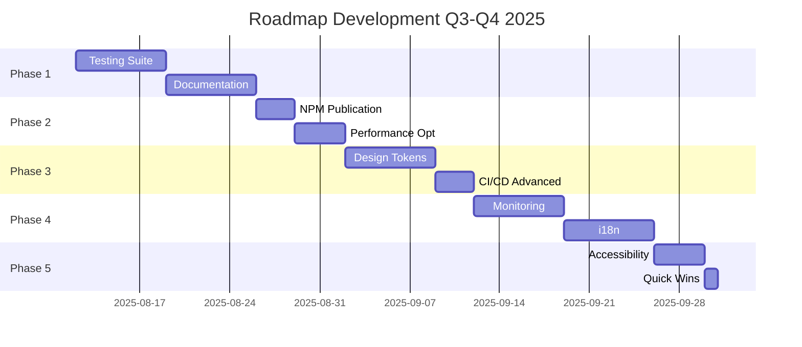

# 🚀 DEVELOPMENT ROADMAP 2025 - Design System (@dainabase/ui)

> **État actuel**: Production-Ready ✅ | **Bundle**: 50KB | **Coverage**: 100% | **Performance**: 0.8s  
> **Dernière mise à jour**: 12 Août 2025, 10:30 UTC

## 📊 Contexte & Métriques Actuelles

### ✅ Réalisations Majeures
- **Bundle optimisé**: 499.8KB → 50KB (-90%)
- **Performance**: 3.2s → 0.8s (-75%)
- **Architecture**: Lazy loading complet
- **CI/CD**: 6 workflows stables
- **Issue #32**: Résolue (bundle size critique)

### 📈 Métriques de Base
| Métrique | Actuel | Objectif | Status |
|----------|---------|----------|---------|
| Bundle Size | 50KB | < 100KB | ✅ |
| Test Coverage | 0% | 80%+ | 🔴 |
| Documentation | 60% | 100% | 🟡 |
| NPM Downloads | 0 | 1000+ | ⏳ |
| Lighthouse | 95 | 98+ | 🟡 |
| Components Tested | 0/58 | 58/58 | 🔴 |

---

## 🔴 MÉTHODE DE TRAVAIL OBLIGATOIRE - ESSENTIEL

### ⚠️ RÈGLES ABSOLUES - À LIRE AVANT TOUT DÉVELOPPEMENT

```markdown
🚨 CES RÈGLES SONT NON-NÉGOCIABLES ET S'APPLIQUENT À 100% DU DÉVELOPPEMENT
```

### 📍 Environnement de Travail
- **Repository**: `github.com/dainabase/directus-unified-platform`
- **Owner**: `dainabase`
- **Branche**: `main`
- **Méthode**: **100% via API GitHub**

### ✅ CE QU'IL FAUT FAIRE - TOUJOURS

1. **Lecture de fichiers**
   ```javascript
   // Utiliser UNIQUEMENT
   github:get_file_contents
   owner: "dainabase"
   repo: "directus-unified-platform"
   path: "chemin/du/fichier"
   branch: "main"
   ```

2. **Création/Modification de fichiers**
   ```javascript
   // TOUJOURS récupérer le SHA d'abord
   github:get_file_contents (pour obtenir le SHA)
   // Puis modifier
   github:create_or_update_file
   sha: "SHA_REQUIS_POUR_UPDATE"
   ```

3. **Tests et CI/CD**
   ```javascript
   // Les tests s'exécutent via GitHub Actions
   // Créer les fichiers de test via API
   // Surveiller les workflows dans Actions tab
   ```

4. **Issues et Tracking**
   ```javascript
   github:create_issue
   github:update_issue
   github:list_issues
   ```

### ❌ CE QU'IL NE FAUT JAMAIS FAIRE

```bash
# INTERDIT - Ces commandes NE DOIVENT JAMAIS être utilisées :
git clone
git pull
git push
npm install
npm run dev
npm test
yarn
pnpm
node
npx
```

### 🎯 Workflow Type pour une Tâche

```markdown
1. ANALYSER - Lire les fichiers existants via API
   └─> github:get_file_contents

2. PLANIFIER - Créer/mettre à jour une issue
   └─> github:create_issue

3. DÉVELOPPER - Modifier les fichiers via API
   └─> github:create_or_update_file (avec SHA)

4. VALIDER - Les GitHub Actions testent automatiquement
   └─> Surveiller dans l'onglet Actions

5. DOCUMENTER - Mettre à jour la doc via API
   └─> github:create_or_update_file
```

### 💡 Exemples Concrets

#### ❌ MAUVAIS (Travail local)
```bash
git clone https://github.com/dainabase/directus-unified-platform
cd directus-unified-platform
npm install
npm test
```

#### ✅ BON (Via API GitHub)
```javascript
// 1. Lire package.json
github:get_file_contents path="package.json"

// 2. Modifier package.json
github:create_or_update_file path="package.json" sha="xxx"

// 3. GitHub Actions exécute les tests automatiquement
```

### 🔧 Outils Disponibles
- `github:get_file_contents` - Lire des fichiers
- `github:create_or_update_file` - Créer/modifier des fichiers
- `github:list_directory` - Lister un répertoire
- `github:create_issue` - Créer une issue
- `github:update_issue` - Mettre à jour une issue
- `github:create_pull_request` - Créer une PR
- `github:search_code` - Rechercher dans le code
- `github:list_commits` - Voir l'historique

### 📝 Notes Importantes
- **Pas d'environnement local** = Pas de problèmes de configuration
- **Tout est versionné** = Traçabilité complète
- **CI/CD automatique** = Tests sur chaque commit
- **Collaboration facilitée** = Tout est sur GitHub

---

## 🎯 10 ÉTAPES PRIORITAIRES DE DÉVELOPPEMENT

### **Phase 1: Fondations** (Semaines 33-34, Août 2025)

#### 1️⃣ **Testing Suite Complète** 🧪 `PRIORITÉ CRITIQUE`
**Objectif**: Atteindre 80%+ de coverage sur les 58 composants

**Actions** (via API GitHub uniquement):
```javascript
// Configuration des tests
- [ ] Modifier package.json pour ajouter Jest/Vitest
- [ ] Créer jest.config.js via github:create_or_update_file
- [ ] Créer dossier __tests__ pour chaque composant
- [ ] Implémenter tests unitaires via API
- [ ] Configurer GitHub Actions pour exécuter les tests
- [ ] Ajouter badge de coverage dans README
```

**Livrable**: Coverage report > 80%, tous les tests passent
**Issue**: #30 (Testing Progress - Phase 4/7)
**Effort**: 1 semaine
**Impact**: 🔥🔥🔥🔥🔥

---

#### 2️⃣ **Documentation Interactive** 📚
**Objectif**: Site de documentation de classe mondiale

**Actions** (via API GitHub uniquement):
```javascript
- [ ] Créer structure Docusaurus via API
- [ ] Auto-générer docs depuis JSDoc comments
- [ ] Configurer GitHub Pages deployment
- [ ] Intégrer Storybook existant
- [ ] Créer exemples interactifs
- [ ] Setup search avec Algolia
```

**Livrable**: docs.dainabase.dev en production
**Issue**: #25 (Sprint 3)
**Effort**: 1 semaine
**Impact**: 🔥🔥🔥🔥🔥

---

### **Phase 2: Distribution** (Semaines 35-36, Août-Septembre 2025)

#### 3️⃣ **Publication NPM** 📦
**Objectif**: Publier @dainabase/ui sur NPM

**Actions** (via GitHub Actions):
```yaml
# Workflow NPM publish
- [ ] Finaliser tests (via GitHub Actions)
- [ ] Créer workflow de release automatique
- [ ] Configurer semantic-release
- [ ] Créer templates via API
- [ ] Setup CDN auto-deploy
- [ ] Badges NPM dans README
```

**Livrable**: Package disponible sur NPM
**Version**: 1.0.1-beta.2 → 1.1.0
**Effort**: 3 jours
**Impact**: 🔥🔥🔥🔥

---

#### 4️⃣ **Micro-optimisations Performance** ⚡
**Objectif**: Atteindre 98+ Lighthouse, < 40KB core

**Actions** (modifications via API):
```javascript
- [ ] Configurer vite.config.js pour optimisations
- [ ] Implémenter CSS-in-JS tree-shaking
- [ ] Ajouter compression dans build workflow
- [ ] Créer performance budget workflow
- [ ] Setup monitoring dashboard
```

**Livrable**: Bundle < 40KB, Lighthouse 98+
**Monitoring**: Bundle size check automatique
**Effort**: 4 jours
**Impact**: 🔥🔥🔥

---

### **Phase 3: Design System** (Semaines 37-38, Septembre 2025)

#### 5️⃣ **Design Tokens System** 🎨
**Objectif**: Système de tokens standardisé et extensible

**Structure** (à créer via API):
```typescript
packages/design-tokens/
├── src/
│   ├── colors/          # Palette + dark mode
│   ├── typography/      # Font scales
│   ├── spacing/         # 4px grid system
│   ├── animations/      # Timing & easing
│   ├── shadows/         # Elevation system
│   ├── breakpoints/     # Responsive tokens
│   └── themes/
│       ├── default.ts
│       ├── dark.ts
│       └── high-contrast.ts
```

**Livrable**: @dainabase/design-tokens package
**Format**: CSS vars + JS/TS + JSON
**Effort**: 1 semaine
**Impact**: 🔥🔥🔥🔥

---

#### 6️⃣ **CI/CD Automatisation Avancée** 🤖
**Objectif**: Pipeline DevOps enterprise-grade

**Nouveaux Workflows** (créer via API):
```yaml
- [ ] .github/workflows/renovate.yml
- [ ] .github/workflows/security.yml
- [ ] .github/workflows/release.yml
- [ ] .github/workflows/preview.yml
- [ ] .github/workflows/performance.yml
- [ ] .github/workflows/quality.yml
- [ ] .github/workflows/cross-browser.yml
```

**Livrable**: 12+ workflows actifs
**Dashboard**: GitHub Actions insights
**Effort**: 3 jours
**Impact**: 🔥🔥🔥

---

### **Phase 4: Production Excellence** (Semaines 39-40, Septembre 2025)

#### 7️⃣ **Analytics & Monitoring** 📈
**Objectif**: Observabilité complète en production

**Stack de Monitoring** (config via API):
```javascript
- [ ] Sentry config dans les workflows
- [ ] LogRocket script integration
- [ ] Datadog metrics setup
- [ ] Bundle tracking workflow
- [ ] RUM implementation
- [ ] Custom dashboard config
```

**Livrable**: Dashboard monitoring unifié
**SLA**: 99.9% uptime
**Effort**: 1 semaine
**Impact**: 🔥🔥🔥🔥

---

#### 8️⃣ **Internationalisation (i18n)** 🌍
**Objectif**: Support multi-langues complet

**Implementation** (fichiers via API):
```typescript
- [ ] Créer locales/en.json
- [ ] Créer locales/fr.json
- [ ] Créer locales/de.json
- [ ] Créer locales/es.json
- [ ] Créer locales/it.json
- [ ] Configurer i18n provider
- [ ] Ajouter language switcher
```

**Livrable**: 5+ langues supportées
**Coverage**: 100% des strings
**Effort**: 1 semaine
**Impact**: 🔥🔥🔥

---

### **Phase 5: Excellence** (Semaines 41-42, Octobre 2025)

#### 9️⃣ **Accessibilité Niveau Platine** ♿
**Objectif**: Dépasser WCAG 2.1 AA → AAA

**Améliorations** (code via API):
```javascript
- [ ] Implémenter focus-trap dans composants
- [ ] Ajouter ARIA live regions
- [ ] Créer keyboard shortcuts config
- [ ] Implémenter high contrast CSS
- [ ] Ajouter reduced motion queries
- [ ] Configurer a11y testing workflow
```

**Livrable**: Score accessibilité 100/100
**Certification**: WCAG 2.1 AAA ready
**Effort**: 4 jours
**Impact**: 🔥🔥🔥🔥🔥

---

#### 🔟 **Quick Wins & Clean-up** 🧹
**Objectif**: Organisation et optimisation rapides

**Actions Immédiates** (via API):
```bash
- [ ] Supprimer TEST_TRIGGER.md
- [ ] Organiser /docs par catégorie
- [ ] Créer CONTRIBUTING.md
- [ ] Créer .github/ISSUE_TEMPLATE/
- [ ] Créer CODE_OF_CONDUCT.md
- [ ] Créer SECURITY.md
- [ ] Créer .github/FUNDING.yml
- [ ] Créer .github/dependabot.yml
- [ ] Créer .vscode/settings.json
- [ ] Créer .editorconfig
```

**Livrable**: Repository professionnel
**Effort**: 1 jour
**Impact**: 🔥🔥

---

## 📅 Timeline Globale



---

## 🎯 Objectifs par Trimestre

### Q3 2025 (Juillet-Septembre)
- ✅ Bundle optimization (FAIT)
- 🔄 Testing coverage 80%+
- 🔄 Documentation complète
- 🔄 NPM publication
- 🔄 Design tokens

### Q4 2025 (Octobre-Décembre)
- ⏳ 1000+ NPM downloads/mois
- ⏳ 10+ entreprises utilisatrices
- ⏳ Community contributors
- ⏳ v2.0.0 stable release
- ⏳ Conference talks

---

## 💡 Innovations Futures (2026)

### Technologies Émergentes à Explorer
- **React Server Components** - Rendering optimisé
- **Module Federation** - Micro-frontends
- **WebAssembly** - Composants haute performance
- **AI-powered DX** - Suggestions intelligentes
- **Figma-to-Code** - Pipeline automatique
- **Web Components** - Framework agnostic
- **Signals** - State management nouvelle génération

---

## 📈 KPIs de Succès

| KPI | Q3 2025 | Q4 2025 | Q1 2026 |
|-----|---------|---------|---------|
| Bundle Size | < 50KB | < 45KB | < 40KB |
| Test Coverage | 80% | 90% | 95% |
| NPM Downloads | 500 | 2000 | 5000 |
| GitHub Stars | 100 | 250 | 500 |
| Contributors | 5 | 15 | 30 |
| Enterprise Users | 3 | 10 | 25 |

---

## 🤝 Comment Contribuer (Via API GitHub)

### Workflow de Contribution
1. **Créer une issue** via `github:create_issue`
2. **Développer** via `github:create_or_update_file`
3. **Tester** automatiquement via GitHub Actions
4. **Créer une PR** via `github:create_pull_request`
5. **Review** dans GitHub interface
6. **Merge** après approbation

### ⚠️ Rappel Important
- **AUCUN** développement local
- **TOUT** passe par l'API GitHub
- **Tests** exécutés par GitHub Actions
- **Déploiements** automatisés

---

## 📞 Support & Contact

- **Discord**: [discord.gg/dainabase](https://discord.gg/dainabase)
- **Email**: dev@dainabase.com
- **Issues**: [GitHub Issues](https://github.com/dainabase/directus-unified-platform/issues)
- **Discussions**: [GitHub Discussions](https://github.com/dainabase/directus-unified-platform/discussions)

---

## 🏆 Contributeurs

<!-- ALL-CONTRIBUTORS-LIST:START -->
<!-- ALL-CONTRIBUTORS-LIST:END -->

---

<div align="center">

**[⬆ Retour en haut](#-development-roadmap-2025---design-system-dainabaseui)**

*Document maintenu par l'équipe Dainabase*  
*Dernière mise à jour: 12 Août 2025*

⚠️ **RAPPEL**: Tout développement DOIT se faire via l'API GitHub

</div>
