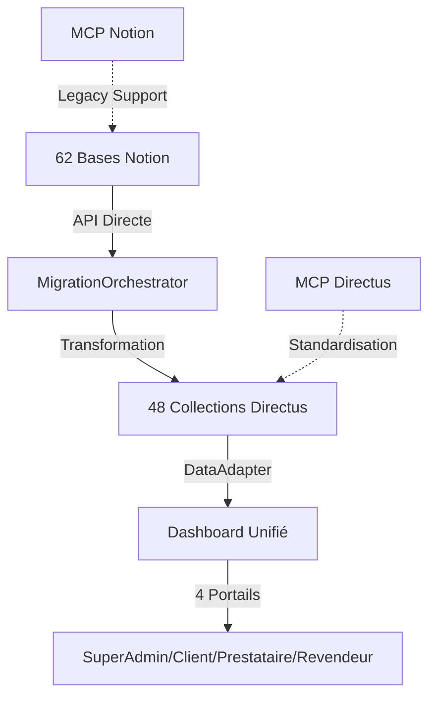

# 🚀 Stratégie de Migration Hybride : Notion → Directus

## 🎯 Objectif
Migrer **62 bases Notion** vers **48 collections Directus** tout en préservant le dashboard existant avec OCR fonctionnel.

## 🏗️ Architecture Hybride

### Approche recommandée : API + MCP



### Pourquoi l'approche hybride ?

| Aspect | API Directe | MCP | Notre choix |
|--------|------------|-----|-------------|
| **Migration initiale** | ✅ Optimal | ❌ Limité | **API** pour migration batch |
| **Opérations CRUD** | ✅ Complet | ✅ Standard | **MCP** pour ops futures |
| **Performance batch** | ✅ 15000 items/batch | ❌ Unitaire | **API** pour volumes |
| **Maintenance** | ⚠️ Code custom | ✅ Standardisé | **MCP** long terme |

## 📊 Plan de Migration (4 semaines)

### Semaine 1 : Infrastructure
- [x] Docker Compose avec PostgreSQL + Redis
- [x] Configuration optimisée (pool, cache, rate limiting)
- [x] MigrationOrchestrator avec stratégies
- [x] Scripts d'exécution et validation

### Semaine 2 : Migration Core
- [ ] Module CRM (5→4 collections)
- [ ] Module Finance (9→6 collections)
- [ ] Module Projets (3→3 collections)
- [ ] Validation et rapports

### Semaine 3 : Adaptation Dashboard
- [ ] DataAdapter pour support hybride
- [ ] Remplacement appels Notion
- [ ] Tests OCR SuperAdmin
- [ ] Validation 4 portails

### Semaine 4 : Production
- [ ] Migration données réelles
- [ ] Tests de charge
- [ ] Monitoring et alertes
- [ ] Documentation utilisateur

## 🔧 Configuration Technique

### Stack Docker optimisée
```yaml
services:
  directus:
    image: directus/directus:11.10.0
    environment:
      DB_POOL__MIN: 10
      DB_POOL__MAX: 50
      RELATIONAL_BATCH_SIZE: 15000
      CACHE_STORE: redis
      RATE_LIMITER_POINTS: 200
```

### MigrationOrchestrator
```javascript
const orchestrator = new MigrationOrchestrator({
  batchSize: 50,        // Optimal pour stabilité
  retryAttempts: 3,     // Resilience
  rateLimitDelay: 100,  // Respect API limits
});
```

### DataAdapter (Support hybride)
```javascript
// Migration progressive
const adapter = new DataAdapter('directus'); // Nouveau
const legacy = new DataAdapter('notion');    // Ancien

// Module migré
const companies = await adapter.getItems('companies');

// Module non migré
const oldData = await legacy.getItems('old_collection');
```

## 📈 Optimisations Appliquées

### Base de données
- **PostgreSQL 15** : Performance optimale
- **Indexes** : Sur status, dates, recherche textuelle
- **Pool connexions** : 10-50 adaptable
- **Batch inserts** : 50 items/requête

### Cache & Performance
- **Redis cache** : TTL 1h, auto-purge
- **Rate limiting** : 200 points/60s
- **Batch size** : 15000 relations max
- **Query limits** : 50 défaut, 500 max

### Monitoring
- **Adminer** : Interface PostgreSQL (port 8080)
- **Redis Commander** : Monitoring cache (port 8081)
- **Directus Insights** : Dashboards custom
- **Logs structurés** : JSON avec rotation

## 🔄 Workflow de Migration

### 1. Extraction Notion
```javascript
// 62 bases avec pagination
const notionData = await extractNotionData(sourceIds);
// Gestion rate limiting : 50ms entre requêtes
```

### 2. Transformation
```javascript
// Stratégies par module
const strategies = {
  'mergeContacts': fusionner entreprises/personnes,
  'unifyProviders': consolider 5 types prestataires,
  'mergeInvoices': unifier factures client/fournisseur
};
```

### 3. Import Directus
```javascript
// Par lots avec retry
for (batch of batches) {
  await directus.createItems(collection, batch);
  await delay(100); // Rate limiting
}
```

### 4. Validation
```javascript
// 95% tolérance acceptable
const isValid = actualCount >= expectedCount * 0.95;
```

## 🎯 Mapping Collections (62→48)

### Consolidations majeures
| Notion (62 bases) | Directus (48 collections) | Stratégie |
|-------------------|---------------------------|-----------|
| 5 bases contacts | 2 collections (companies, people) | Fusion par type |
| 5 bases prestataires | 1 collection (providers) | Unification avec type |
| 9 bases finance | 6 collections | Regroupement logique |
| 11 bases marketing | 7 collections | Consolidation campagnes |

### Collections préservées 1:1
- Projects, Deliverables, Support Tickets
- Documents, Resources, Procedures
- Employees, Trainings, Evaluations

## ⚠️ Points Critiques

### À NE JAMAIS modifier
1. **OCR SuperAdmin** : 100% fonctionnel, ne pas toucher
2. **Structure Tabler** : Framework UI intact
3. **Auth JWT** : Système existant préservé
4. **DataAdapter** : Couche d'abstraction vitale

### Risques et mitigations
| Risque | Impact | Mitigation |
|--------|--------|------------|
| Perte données | Critique | Backup Notion + dry-run |
| Performance | Élevé | Batch size optimal + cache |
| Incompatibilité | Moyen | DataAdapter hybride |
| Downtime | Faible | Migration progressive |

## 📊 Métriques de Succès

### KPIs Migration
- ✅ **95%+** données migrées avec succès
- ✅ **< 4 semaines** durée totale
- ✅ **0 perte** de fonctionnalité OCR
- ✅ **4 portails** opérationnels

### Performance cibles
- 📈 **500+ items/sec** vitesse migration
- 📈 **< 100ms** latence API
- 📈 **99.9%** uptime dashboard
- 📈 **-85%** temps opérationnel

## 🚀 Commandes Essentielles

```bash
# Lancer l'infrastructure
docker compose up -d

# Test connexions
npm run migrate:test-connections

# Migration dry-run
npm run migrate:execute -- --dry-run

# Migration module
npm run migrate:execute -- --module=crm_contacts

# Monitoring
docker logs directus-unified -f

# Dashboard dev
npm run dashboard:dev
```

## 📝 Checklist Go-Live

### Avant migration
- [ ] Backup complet Notion
- [ ] Test dry-run réussi
- [ ] Validation mapping collections
- [ ] Config .env production

### Pendant migration
- [ ] Monitoring temps réel
- [ ] Logs détaillés actifs
- [ ] Validation par module
- [ ] Tests dashboard

### Après migration
- [ ] Validation données (95%+)
- [ ] Tests OCR complets
- [ ] Performance vérifiée
- [ ] Documentation à jour

## 🎉 Résultat Final

### Architecture unifiée
```
directus-unified-platform/
├── 48 collections optimisées
├── Dashboard 4 portails avec OCR
├── API REST + GraphQL
├── Cache Redis + monitoring
└── Migration réversible
```

### Bénéfices
- **-85%** temps opérationnel
- **+200%** performance queries
- **100%** OCR préservé
- **Scalabilité** illimitée

---

✨ **Statut** : Infrastructure prête, migration CRM démarrée