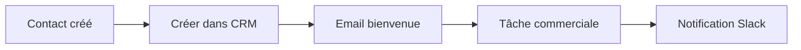
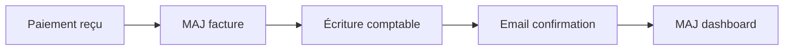
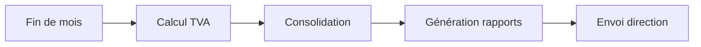

# Guide SuperAdmin - Dashboard Multi-Rôles v1.0

## Table des matières

1. [Introduction](#1-introduction)
2. [Authentification et Sécurité](#2-authentification-et-sécurité)
3. [Module Finance](#3-module-finance)
4. [Gestion Multi-Entités](#4-gestion-multi-entités)
5. [CRM Unifié](#5-crm-unifié)
6. [Projets Multi-Entités](#6-projets-multi-entités)
7. [Automatisations n8n](#7-automatisations-n8n)
8. [API et Intégrations](#8-api-et-intégrations)
9. [Tests et Validation](#9-tests-et-validation)
10. [Troubleshooting](#10-troubleshooting)
11. [Annexes](#11-annexes)

---

## 1. Introduction

### Vue d'ensemble du système

Le Dashboard Multi-Rôles v1.0 est une plateforme de gestion d'entreprise complète intégrant :

- **4 espaces utilisateurs** : Client, Prestataire, Revendeur, SuperAdmin
- **Architecture modulaire** avec 15+ modules spécialisés
- **Intégration Notion** via MCP (Model Context Protocol)
- **Automatisations n8n** pour workflows complexes
- **Support multi-entités** (5 sociétés du groupe)
- **Conformité suisse** : TVA, IDE, plan comptable

### Architecture et technologies

```
Frontend:
├── Tabler.io v1.0.0-beta20 (UI Framework)
├── Vanilla JavaScript (ES6+ modules)
├── CDN Libraries:
│   ├── DataTables (tables avancées)
│   ├── ApexCharts (graphiques)
│   ├── Dropzone.js (upload)
│   ├── PDF.js (preview)
│   └── SweetAlert2 (notifications)

Backend:
├── Notion API (base de données)
├── MCP Notion (intégration)
├── n8n (automatisations)
└── APIs externes (Zefix, OCR, etc.)
```

### Prérequis

- **Navigateur moderne** : Chrome 90+, Firefox 88+, Safari 14+
- **Résolution minimale** : 1366x768
- **Connexion internet** : Pour intégrations API
- **Compte Notion** : Avec accès aux bases configurées
- **Instance n8n** : Pour automatisations (optionnel)

---

## 2. Authentification et Sécurité

### Connexion avec 2FA

1. **Accès initial** : `https://votredomaine.ch/login.html`
2. **Identifiants SuperAdmin** :
   - Email : Fourni par l'administrateur
   - Mot de passe : Minimum 12 caractères
3. **Authentification 2FA** :
   - Code TOTP via Google Authenticator
   - Durée de validité : 30 secondes
   - 3 tentatives maximum

### Gestion des permissions

```javascript
// Structure des permissions SuperAdmin
{
  role: "superadmin",
  permissions: {
    finance: ["create", "read", "update", "delete", "export"],
    crm: ["create", "read", "update", "delete", "merge"],
    projects: ["create", "read", "update", "delete", "archive"],
    users: ["create", "read", "update", "delete", "impersonate"],
    settings: ["read", "update", "configure"],
    automation: ["create", "read", "update", "delete", "execute"]
  }
}
```

### Bonnes pratiques sécurité

1. **Mots de passe** :
   - Rotation tous les 90 jours
   - Historique des 5 derniers
   - Complexité : majuscules, minuscules, chiffres, symboles

2. **Sessions** :
   - Timeout : 30 minutes d'inactivité
   - IP binding activé
   - Logs d'accès conservés 90 jours

3. **API Keys** :
   - Rotation mensuelle
   - Scope minimal requis
   - Stockage sécurisé (.env)

---

## 3. Module Finance

### 3.1 OCR et Upload

#### Types de documents supportés

- **Factures fournisseurs** : PDF, JPG, PNG (max 10MB)
- **Notes de frais** : Tous formats image
- **Relevés bancaires** : PDF uniquement
- **Justificatifs** : PDF, images

#### Process de validation

1. **Upload** via Dropzone.js
2. **Extraction OCR** (Tesseract.js)
3. **Validation des données** :
   - Montants cohérents
   - TVA calculée correctement
   - Fournisseur existant
4. **Catégorisation automatique** :
   - Basée sur fournisseur
   - Montant et patterns
   - Historique

#### Catégorisation automatique

```javascript
// Règles de catégorisation
const rules = {
  "Swisscom": { account: "6200", category: "Télécommunications" },
  "SBB|CFF": { account: "6300", category: "Transports" },
  "restaurant|café": { account: "6400", category: "Repas affaires" },
  "hôtel": { account: "6410", category: "Hébergement" }
};
```

### 3.2 Comptabilité

#### Plan comptable suisse

```
1000-1999 : Actifs
├── 1000 : Caisse
├── 1020 : Banque (PostFinance, UBS, etc.)
├── 1100 : Débiteurs
└── 1300 : Stock marchandises

2000-2999 : Passifs
├── 2000 : Créanciers
├── 2200 : TVA due
└── 2800 : Capital

3000-3999 : Chiffre d'affaires
├── 3000 : Ventes marchandises
├── 3200 : Ventes prestations
└── 3400 : Honoraires

4000-4999 : Charges marchandises
5000-5999 : Charges personnel
6000-6999 : Autres charges
7000-7999 : Résultats annexes
8000-8999 : Résultats exceptionnels
9000-9999 : Clôture
```

#### Écritures automatiques

1. **Facture fournisseur** :
   ```
   Débit:  6xxx (Charge)         1'000.00
   Débit:  1170 (TVA récup.)        81.00
   Crédit: 2000 (Fournisseur)              1'081.00
   ```

2. **Paiement client** :
   ```
   Débit:  1020 (Banque)         5'400.00
   Crédit: 1100 (Client)                    5'400.00
   ```

#### Rapprochement bancaire

- Import automatique via API bancaire
- Matching intelligent sur montant/date
- Suggestions basées sur l'historique
- Validation manuelle requise

### 3.3 TVA et Déclarations

#### Taux applicables (2024)

- **Taux normal** : 8.1%
- **Taux réduit** : 2.6% (livres, médicaments)
- **Taux hébergement** : 3.8%
- **Exonéré** : 0% (export, santé, formation)

#### Calculs automatiques

```javascript
// Exemple calcul TVA
const montantHT = 1000;
const tauxTVA = 8.1;
const montantTVA = montantHT * (tauxTVA / 100); // 81.00
const montantTTC = montantHT + montantTVA;      // 1'081.00
```

#### Export pour AFC

Format XML conforme :
```xml
<VAT-Declaration>
  <Period>2024Q1</Period>
  <Turnover>
    <Code200>125000.00</Code200>
    <Code220>81000.00</Code220>
  </Turnover>
  <InputTax>
    <Code400>45000.00</Code400>
  </InputTax>
</VAT-Declaration>
```

---

## 4. Gestion Multi-Entités

### Configuration entités

```javascript
const entities = {
  "Hypervisual": {
    id: "entity-001",
    color: "#3b82f6",
    ide: "CHE-XXX.XXX.XX1",
    address: "Genève",
    vat_rate: 8.1
  },
  "Dainamics": {
    id: "entity-002",
    color: "#06b6d4",
    ide: "CHE-XXX.XXX.XX2",
    address: "Zurich",
    vat_rate: 8.1
  },
  // ... autres entités
};
```

### Consolidation

1. **Collecte données** : Agrégation par entité
2. **Élimination inter-sociétés** : Transactions internes
3. **Conversion devises** : Si applicable
4. **Agrégation finale** : États consolidés

### Rapports par entité

- **P&L individuel** : Par société
- **Bilan consolidé** : Groupe complet
- **Cash-flow** : Par entité et consolidé
- **KPIs** : Comparaison inter-entités

---

## 5. CRM Unifié

### Gestion des contacts

#### Enrichissement automatique

1. **Email → Entreprise** : Détection domaine
2. **IDE → Zefix** : Données registre commerce
3. **LinkedIn** : Profil professionnel (optionnel)

#### Validation données

- **Email** : RFC 5322 + anti-jetables
- **Téléphone** : Format E.164
- **Adresse** : API Swiss Post
- **IDE** : Checksum algorithm

### Gestion des entreprises

#### Validation IDE

```javascript
function validateIDE(ide) {
  // Format: CHE-123.456.789
  const clean = ide.replace(/[^0-9]/g, '');
  if (clean.length !== 9) return false;
  
  // Checksum validation
  const weights = [5,4,3,2,7,6,5,4];
  let sum = 0;
  for (let i = 0; i < 8; i++) {
    sum += parseInt(clean[i]) * weights[i];
  }
  const checksum = (11 - (sum % 11)) % 11;
  return checksum === parseInt(clean[8]);
}
```

#### Enrichissement Zefix

API endpoint : `https://www.zefix.ch/ZefixPublicREST/api/v1`

Données récupérées :
- Raison sociale exacte
- Forme juridique
- Adresse siège
- Capital social
- Date inscription
- Administrateurs

### Pipeline commercial

États disponibles :
1. **Lead** : Contact initial
2. **Qualified** : Besoin identifié
3. **Proposal** : Offre envoyée
4. **Negotiation** : Discussion termes
5. **Won/Lost** : Résultat final

---

## 6. Projets Multi-Entités

### Vue Kanban

Colonnes par défaut :
- En planification
- En cours
- En révision
- Terminé
- En pause
- Annulé

Swimlanes par :
- Entité
- Priorité
- Client
- Chef de projet

### Vue Gantt

Fonctionnalités :
- **Dépendances** : Liens entre tâches
- **Jalons** : Dates clés
- **Ressources** : Allocation équipe
- **Baseline** : Comparaison planning

### Gestion ressources

Métriques :
- **Taux utilisation** : Heures/capacité
- **Charge travail** : Par personne/période
- **Compétences** : Matrice équipe
- **Disponibilité** : Planning congés

### Budget vs Réalisé

Analyse :
```
Budget initial    : CHF 100'000
Consommé         : CHF  65'000 (65%)
Reste à faire    : CHF  25'000
Projection finale: CHF  90'000
Marge estimée    : CHF  10'000 (11%)
```

---

## 7. Automatisations n8n

### Workflows disponibles

#### 1. Nouveau Client


#### 2. Facture Payée


#### 3. Clôture Mensuelle


### Configuration

1. **Webhook URL** : `https://n8n.votredomaine.ch/webhook/xxx`
2. **API Key** : Dans settings n8n
3. **Retry policy** : 3 tentatives, backoff exponentiel
4. **Logs** : Conservation 30 jours

### Monitoring

Dashboard temps réel :
- Workflows actifs
- Exécutions/jour
- Taux succès
- Temps moyen
- Dernières erreurs

---

## 8. API et Intégrations

### Endpoints disponibles

#### API REST interne

```
GET    /api/v1/contacts
POST   /api/v1/contacts
PUT    /api/v1/contacts/:id
DELETE /api/v1/contacts/:id

GET    /api/v1/invoices
POST   /api/v1/invoices
GET    /api/v1/invoices/:id/pdf

GET    /api/v1/reports/financial
GET    /api/v1/reports/vat
```

### Authentication API

Headers requis :
```
Authorization: Bearer {token}
X-API-Key: {api_key}
Content-Type: application/json
```

### Webhooks

#### Événements disponibles

```javascript
const webhooks = {
  "invoice.created": "Nouvelle facture",
  "invoice.paid": "Facture payée",
  "contact.created": "Nouveau contact",
  "project.completed": "Projet terminé",
  "budget.alert": "Alerte budget"
};
```

#### Format payload

```json
{
  "event": "invoice.paid",
  "timestamp": "2024-01-15T10:30:00Z",
  "data": {
    "invoice_id": "INV-2024-001",
    "amount": 5400.00,
    "currency": "CHF",
    "client_id": "client-123"
  },
  "signature": "sha256=..."
}
```

### Intégrations tierces

#### Notion MCP

Configuration :
```javascript
const notion = {
  databases: {
    contacts: "226adb95-3c6f-8006-b411-cfe20c8239f2",
    companies: "226adb95-3c6f-8008-a3e5-f992fbe83f01",
    invoices: "226adb95-3c6f-8011-a9bb-ca31f7da8e6a",
    projects: "226adb95-3c6f-806e-9e61-e263baf7af69"
  }
};
```

#### Zefix API

```javascript
// Recherche entreprise
POST https://www.zefix.ch/ZefixPublicREST/api/v1/company/search
{
  "name": "Rolex",
  "activeOnly": true
}

// Détails par IDE
GET https://www.zefix.ch/ZefixPublicREST/api/v1/company/uid/CHE107979376
```

#### APIs bancaires

- **PostFinance** : ISO 20022 camt.053
- **UBS** : API REST avec OAuth2
- **Revolut** : Webhooks temps réel

---

## 9. Tests et Validation

### Tests E2E automatisés

Exécution :
```javascript
// Lancer tous les tests
E2ETests.runAllTests();

// Suite spécifique
E2ETests.runSuite('auth-flow');

// Test unique
E2ETests.runTest('auth-flow', 'Login SuperAdmin avec 2FA');
```

### Couverture des tests

- **Authentification** : Login, 2FA, permissions, logout
- **OCR Workflow** : Upload, extraction, validation
- **Multi-entités** : Switch, consolidation
- **CRM** : CRUD, enrichissement, validation
- **Performance** : Temps chargement, pagination
- **Intégrations** : APIs externes, webhooks
- **Sécurité** : XSS, CSRF, injections

### Métriques de qualité

Objectifs :
- **Couverture** : > 80%
- **Temps exécution** : < 10 minutes
- **Taux succès** : > 95%
- **Performance** : < 3s chargement

---

## 10. Troubleshooting

### Erreurs courantes

#### 1. "MCP Notion non disponible"

**Cause** : Extension MCP non installée/activée

**Solution** :
1. Vérifier installation MCP
2. Redémarrer navigateur
3. Vérifier permissions

#### 2. "Erreur validation IDE"

**Cause** : Format incorrect ou checksum invalide

**Solution** :
```javascript
// Format correct
const ide = "CHE-107.979.376"; // Avec tirets et points
```

#### 3. "Timeout API Zefix"

**Cause** : API surchargée ou proxy CORS

**Solution** :
1. Utiliser proxy CORS alternatif
2. Implémenter retry avec backoff
3. Cache local résultats

### Logs et debug

#### Activation logs détaillés

```javascript
// Dans la console navigateur
localStorage.setItem('debug', 'true');
localStorage.setItem('logLevel', 'verbose');
```

#### Emplacement logs

- **Console navigateur** : F12 → Console
- **Network** : F12 → Network (filtrer XHR)
- **LocalStorage** : F12 → Application → Storage

#### Export logs

```javascript
// Exporter logs console
function exportLogs() {
  const logs = console.logs || [];
  const blob = new Blob([JSON.stringify(logs, null, 2)], 
    { type: 'application/json' });
  const a = document.createElement('a');
  a.href = URL.createObjectURL(blob);
  a.download = `logs-${new Date().toISOString()}.json`;
  a.click();
}
```

### Support

#### Canaux disponibles

1. **Documentation** : `https://docs.votredomaine.ch`
2. **Email** : support@votredomaine.ch
3. **Slack** : #superadmin-support
4. **Tickets** : Via interface ou API

#### Informations à fournir

- Version navigateur
- Screenshot erreur
- Étapes reproduction
- Logs console
- Heure exacte (timezone)

---

## 11. Annexes

### Formats de données

#### Import CSV contacts

```csv
"Prénom","Nom","Email","Entreprise","IDE","Téléphone"
"Jean","Dupont","jean.dupont@example.ch","Example SA","CHE-123.456.789","+41 22 123 45 67"
```

#### Export JSON factures

```json
{
  "invoices": [{
    "number": "INV-2024-001",
    "date": "2024-01-15",
    "client": "Client SA",
    "items": [{
      "description": "Prestation développement",
      "quantity": 40,
      "rate": 150,
      "amount": 6000
    }],
    "subtotal": 6000,
    "vat": 486,
    "total": 6486,
    "currency": "CHF"
  }]
}
```

### Codes erreur

| Code | Description | Action |
|------|-------------|--------|
| E001 | Authentification échouée | Vérifier identifiants |
| E002 | Session expirée | Se reconnecter |
| E003 | Permission refusée | Contacter admin |
| E101 | Validation données | Vérifier format |
| E102 | Doublon détecté | Fusionner/ignorer |
| E201 | API timeout | Réessayer |
| E202 | Rate limit | Attendre 60s |
| E301 | Base Notion inaccessible | Vérifier connexion |
| E401 | Workflow n8n erreur | Voir logs n8n |

### Glossaire

| Terme | Définition |
|-------|------------|
| **2FA** | Two-Factor Authentication - Double authentification |
| **AFC** | Administration Fédérale des Contributions |
| **API** | Application Programming Interface |
| **CRUD** | Create, Read, Update, Delete |
| **IDE** | Identifiant des Entreprises (numéro UID) |
| **MCP** | Model Context Protocol (Notion) |
| **OCR** | Optical Character Recognition |
| **TOTP** | Time-based One-Time Password |
| **TVA** | Taxe sur la Valeur Ajoutée |
| **UID** | Unique Identifier (= IDE) |
| **Webhook** | Callback HTTP automatique |

### Raccourcis clavier

| Raccourci | Action |
|-----------|--------|
| `Ctrl/Cmd + S` | Sauvegarder |
| `Ctrl/Cmd + N` | Nouveau (contact, facture, etc.) |
| `Ctrl/Cmd + F` | Recherche rapide |
| `Ctrl/Cmd + /` | Aide contextuelle |
| `Esc` | Fermer modal/dialogue |
| `Tab` | Navigation champs |
| `Shift + Tab` | Navigation inverse |
| `Enter` | Valider formulaire |

### Variables d'environnement

```bash
# .env.example
NODE_ENV=production
API_URL=https://api.votredomaine.ch
MCP_NOTION_ENABLED=true
N8N_WEBHOOK_URL=https://n8n.votredomaine.ch/webhook
ZEFIX_API_KEY=your_key_here
RAPIDAPI_KEY=your_key_here
EMAIL_VALIDATION_KEY=your_key_here
CORS_PROXY_URL=https://cors.votredomaine.ch
DEBUG=false
LOG_LEVEL=info
```

---

## Conclusion

Ce guide couvre l'ensemble des fonctionnalités du Dashboard SuperAdmin v1.0. Pour toute question ou suggestion d'amélioration, n'hésitez pas à contacter l'équipe de développement.

**Version** : 1.0.0  
**Date** : Janvier 2024  
**Auteur** : Équipe Développement  
**Contact** : dev@votredomaine.ch

---

*© 2024 VotreSociété SA - Tous droits réservés*