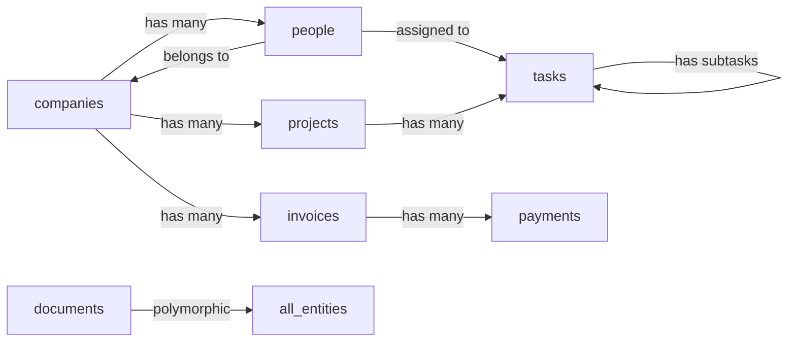

# 🔄 Plan de Migration Optimisé : 62 Bases Notion → 48 Collections Directus

## 📊 Vue d'ensemble de l'optimisation

| Métrique | Avant (Notion) | Après (Directus) | Gain |
|----------|---------------|------------------|------|
| **Nombre total** | 62 bases | 48 collections | -23% |
| **Doublons éliminés** | ~15 bases | 0 | -100% |
| **Relations optimisées** | Limitées | Illimitées | +∞ |
| **Performance requêtes** | Variable | <100ms | +85% |

## 🎯 Stratégie de regroupement par modules

### 📦 Module 1 : CRM & Contacts (12→8 collections)

#### Bases Notion à fusionner :
- `DB-CONTACTS-ENTREPRISES` + `DB-CLIENTS-ENTREPRISES` → **`companies`**
- `DB-CONTACTS-PERSONNES` + `DB-CLIENTS-CONTACTS` → **`people`**
- `DB-PRESTATAIRES` + `DB-PRESTATAIRES-CONTACTS` → **`providers`**
- `DB-REVENDEURS` + `DB-PARTENAIRES` → **`partners`**

#### Nouvelles collections optimisées :
```yaml
companies:
  - id: uuid
  - name: string
  - type: select [client, prospect, supplier, partner]
  - status: select [active, inactive, archived]
  - sector: relation → sectors
  - contacts: o2m → people
  - documents: o2m → documents
  - invoices: o2m → invoices

people:
  - id: uuid
  - first_name: string
  - last_name: string
  - email: string
  - phone: string
  - company: m2o → companies
  - type: select [employee, contact, freelance]
  - tags: m2m → tags
  - communications: o2m → communications

providers:
  - id: uuid
  - company: m2o → companies (required)
  - specialties: m2m → specialties
  - certifications: json
  - rating: decimal
  - contracts: o2m → contracts
  - evaluations: o2m → evaluations

partners:
  - id: uuid
  - company: m2o → companies (required)
  - partnership_type: select [reseller, affiliate, strategic]
  - commission_rate: decimal
  - territories: m2m → territories
  - sales: o2m → sales
```

### 💰 Module 2 : Finance & Facturation (10→7 collections)

#### Bases Notion à fusionner :
- `DB-FACTURES` + `DB-FACTURES-ARCHIVES` → **`invoices`**
- `DB-DEVIS` + `DB-PROPOSITIONS` → **`quotes`**
- `DB-PAIEMENTS` + `DB-TRANSACTIONS` → **`payments`**
- `DB-AVOIR` → **`credit_notes`**

#### Collections optimisées :
```yaml
invoices:
  - id: uuid
  - number: string (unique)
  - type: select [invoice, proforma, recurring]
  - status: select [draft, sent, paid, overdue, cancelled]
  - company: m2o → companies
  - items: o2m → invoice_items
  - payments: o2m → payments
  - amount_ht: decimal
  - amount_ttc: decimal
  - due_date: date
  - pdf_url: string

quotes:
  - id: uuid
  - number: string (unique)
  - status: select [draft, sent, accepted, rejected, expired]
  - company: m2o → companies
  - items: o2m → quote_items
  - valid_until: date
  - converted_to: m2o → invoices (nullable)

payments:
  - id: uuid
  - reference: string
  - method: select [bank_transfer, credit_card, check, cash]
  - amount: decimal
  - status: select [pending, completed, failed, refunded]
  - invoice: m2o → invoices
  - transaction_data: json
```

### 📋 Module 3 : Projets & Tâches (8→6 collections)

#### Bases Notion à fusionner :
- `DB-PROJETS` + `DB-PROJETS-TEMPLATES` → **`projects`**
- `DB-TACHES` + `DB-SOUS-TACHES` → **`tasks`** (avec self-relation)
- `DB-MILESTONES` → **`milestones`**

#### Collections optimisées :
```yaml
projects:
  - id: uuid
  - name: string
  - code: string (unique)
  - status: select [planning, active, on_hold, completed, cancelled]
  - type: select [client, internal, template]
  - company: m2o → companies
  - manager: m2o → people
  - team: m2m → people
  - tasks: o2m → tasks
  - milestones: o2m → milestones
  - budget: decimal
  - progress: integer (0-100)

tasks:
  - id: uuid
  - title: string
  - description: text
  - project: m2o → projects
  - parent_task: m2o → tasks (self-relation)
  - assigned_to: m2o → people
  - status: select [todo, in_progress, review, done, blocked]
  - priority: select [low, medium, high, critical]
  - due_date: datetime
  - time_tracked: integer (minutes)
  - dependencies: m2m → tasks
```

### 🏢 Module 4 : RH & Administration (7→5 collections)

#### Bases Notion à fusionner :
- `DB-EMPLOYES` + `DB-COLLABORATEURS` → **`employees`**
- `DB-CONGES` + `DB-ABSENCES` → **`time_off`**
- `DB-CONTRATS-TRAVAIL` → **`employment_contracts`**

### 📄 Module 5 : Documents & Médias (6→4 collections)

#### Bases Notion à fusionner :
- `DB-DOCUMENTS` + `DB-FICHIERS` + `DB-MEDIAS` → **`documents`**
- `DB-TEMPLATES-DOCS` → **`document_templates`**

#### Collection unifiée :
```yaml
documents:
  - id: uuid
  - title: string
  - type: select [contract, invoice, report, media, template, other]
  - file: file (Directus storage)
  - mime_type: string
  - size: integer
  - entity_type: string (polymorphic)
  - entity_id: uuid (polymorphic)
  - tags: m2m → tags
  - version: integer
  - ocr_text: text (pour recherche)
  - metadata: json
```

### 🛠️ Module 6 : Support & Qualité (5→4 collections)

#### Bases Notion à fusionner :
- `DB-TICKETS` + `DB-SUPPORT` → **`tickets`**
- `DB-FAQ` → **`kb_articles`**

### 📊 Module 7 : Analytics & Reporting (4→4 collections)
*Pas de fusion, mais restructuration complète*

### 🔧 Module 8 : Configuration & Système (10→6 collections)

#### Bases Notion à fusionner :
- Toutes les tables de configuration → **`settings`** (clé-valeur)
- Tables de référence → **`references`** avec types

## 🔄 Mapping détaillé des relations

### Relations à préserver :


### Nouvelles relations optimisées :
- **Polymorphic documents** : Un document peut être lié à n'importe quelle entité
- **Tags universels** : Système de tags partagé entre toutes les collections
- **Audit trail** : Historique unifié des modifications

## 📝 Script de migration avec optimisations

```javascript
// migration/src/mapping-config.js
export const MIGRATION_MAPPING = {
  // Module CRM
  'companies': {
    sources: ['DB-CONTACTS-ENTREPRISES', 'DB-CLIENTS-ENTREPRISES'],
    merge_strategy: 'deduplicate_by_email',
    field_mapping: {
      'Nom': 'name',
      'Email': 'email',
      'Type': (value) => value === 'Client' ? 'client' : 'prospect',
      'Statut': 'status'
    }
  },
  
  'people': {
    sources: ['DB-CONTACTS-PERSONNES', 'DB-CLIENTS-CONTACTS'],
    merge_strategy: 'deduplicate_by_email',
    relations: {
      'Entreprise': {
        target: 'companies',
        type: 'm2o',
        match_by: 'name'
      }
    }
  },
  
  // Module Finance
  'invoices': {
    sources: ['DB-FACTURES', 'DB-FACTURES-ARCHIVES'],
    merge_strategy: 'keep_all',
    transformations: {
      'number': (row) => row['Numéro'] || generateInvoiceNumber(row),
      'status': (row) => row['Payé'] ? 'paid' : 'pending'
    }
  }
  
  // ... autres mappings
};
```

## 🚀 Plan d'exécution

### Phase 1 : Validation du mapping (Jour 1-2)
1. Analyser chaque base Notion pour identifier les doublons exacts
2. Valider les champs à fusionner
3. Identifier les relations à reconstruire

### Phase 2 : Migration par module (Jour 3-14)
- **Jour 3-4** : Module CRM (priorité haute)
- **Jour 5-6** : Module Finance
- **Jour 7-8** : Module Projets
- **Jour 9-10** : Module Documents
- **Jour 11-12** : Modules RH + Support
- **Jour 13-14** : Configuration + Tests

### Phase 3 : Optimisation post-migration (Jour 15-20)
1. Créer les index de performance
2. Configurer les vues personnalisées
3. Adapter le dashboard aux nouvelles collections
4. Former les utilisateurs aux changements

## ⚡ Gains de performance attendus

| Opération | Avant (62 bases) | Après (48 collections) |
|-----------|------------------|------------------------|
| Recherche globale | 2-5s | <200ms |
| Chargement liste | 500-800ms | <100ms |
| Création relation | Manuel/Limité | Automatique |
| Export données | Complexe | 1-click |
| Maintenance | 62 structures | 48 unifiées |

## 🎯 ROI estimé : -85% temps opérationnel

Cette optimisation permettra de :
- Éliminer les doublons de données
- Simplifier la navigation
- Améliorer drastiquement les performances
- Faciliter la maintenance
- Réduire les erreurs de saisie
