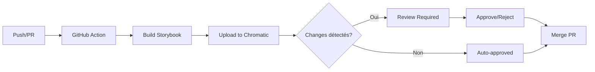

# 🎨 Chromatic - Visual Testing pour @dainabase/ui

## Configuration Status

| Component | Status | Action Required |
|-----------|--------|-----------------|
| Package installé | ✅ | - |
| Config file | ✅ | - |
| GitHub Workflow | ✅ | - |
| Project Token | ❌ | [Créer un compte](#setup) |

## 🚀 Setup Initial

### 1. Créer un compte Chromatic
1. Aller sur [chromatic.com](https://www.chromatic.com)
2. Se connecter avec GitHub
3. Autoriser l'accès au repo `dainabase/directus-unified-platform`

### 2. Créer le projet
1. Cliquer sur **"Add project"**
2. Sélectionner le repo
3. Définir le path Storybook : `packages/ui`
4. Copier le **Project Token** (format: `chpt_xxxxxxxxxxxx`)

### 3. Configurer GitHub Secret
```bash
# Ajouter le secret dans GitHub
# Settings → Secrets → Actions → New repository secret
# Name: CHROMATIC_PROJECT_TOKEN
# Value: [votre token]
```

## 📊 Utilisation

### En local
```bash
# Test manuel
cd packages/ui
npx chromatic --project-token=chpt_xxxxxxxxxxxx

# Ou avec env variable
export CHROMATIC_PROJECT_TOKEN=chpt_xxxxxxxxxxxx
pnpm chromatic
```

### CI/CD automatique
À chaque PR, Chromatic :
1. Build Storybook
2. Capture toutes les stories
3. Compare avec la baseline
4. Génère un rapport visuel
5. Bloque la PR si changements non approuvés

## 🎯 Fonctionnalités

### Tests Visuels (VRT)
- **Snapshot automatique** de chaque story
- **Détection de régression** pixel par pixel
- **Cross-browser testing** (Chrome, Firefox, Safari)
- **Responsive testing** (mobile, tablet, desktop)

### Review UI
- **Interface collaborative** pour review
- **Commentaires** directement sur les changements
- **Approbation** requise avant merge
- **Historique** de toutes les versions

### Intégration GitHub
- **Status checks** automatiques
- **PR comments** avec liens vers les changements
- **Auto-approve** pour la branche main
- **Badges** de build status

## 📈 Workflow


```mermaid
graph LR
    A[Push/PR] --> B[GitHub Action]
    B --> C[Build Storybook]
    C --> D[Upload to Chromatic]
    D --> E{Changes détectés?}
    E -->|Oui| F[Review Required]
    E -->|Non| G[Auto-approved]
    F --> H[Approve/Reject]
    H --> I[Merge PR]
    G --> I
```

## 🔧 Configuration avancée

### chromatic.config.json
```json
{
  "projectId": "Project ID",
  "onlyChanged": true,              // Test seulement les fichiers modifiés
  "skip": "dependabot/**",          // Ignore les branches dependabot
  "autoAcceptChanges": "main",      // Auto-approve sur main
  "exitZeroOnChanges": true,        // Ne pas fail le build
  "exitOnceUploaded": false         // Attendre la review
}
```

### Scripts package.json
```json
{
  "scripts": {
    "chromatic": "chromatic --exit-zero-on-changes",
    "chromatic:ci": "chromatic --only-changed --auto-accept-changes",
    "chromatic:full": "chromatic"
  }
}
```

## 📝 Bonnes pratiques

### 1. Stories complètes
- Créer une story pour chaque état/variant
- Inclure les edge cases
- Documenter les interactions

### 2. Baseline stable
- Approuver les changements intentionnels
- Rejeter les régressions
- Maintenir une baseline propre

### 3. Review collaborative
- Impliquer les designers
- Commenter les changements
- Documenter les décisions

## 🆘 Troubleshooting

| Problème | Solution |
|----------|----------|
| Token invalide | Vérifier le format `chpt_xxxx` |
| Build timeout | Augmenter timeout dans workflow |
| Faux positifs | Ajuster threshold dans config |
| Stories manquantes | Vérifier le build path |

## 📚 Ressources

- [Documentation Chromatic](https://www.chromatic.com/docs)
- [Storybook + Chromatic](https://storybook.js.org/docs/react/workflows/visual-testing)
- [GitHub Actions](https://www.chromatic.com/docs/github-actions)
- [Pricing](https://www.chromatic.com/pricing) - Gratuit pour open source

## 📧 Support

- Issues: [GitHub Issues](https://github.com/dainabase/directus-unified-platform/issues)
- Email: admin@dainamics.ch
- Discord: [Chromatic Discord](https://discord.gg/chromatic)

---

*Configuration Chromatic pour @dainabase/ui - v1.0.0*
